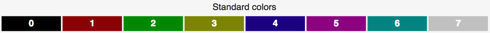
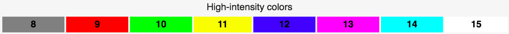

Targets
========

.. contents::

.. role:: vim(code)
    :language: vim

.. role:: bash(code)
    :language: bash

.. role:: python(code)
    :language: python

Terminal
--------

Gnome Terminal
^^^^^^^^^^^^^^

GNOME Terminal is a terminal emulator for the GNOME desktop environment written
by Havoc Pennington and others. In order to create a new profile, this class makes
use of a shell script executing `dconf`_ commands.

.. _`dconf`: https://en.wikipedia.org/wiki/Dconf

iTerm2
^^^^^^

This program is a replacement for Terminal and works on Macs with macOS 10.10 or newer.
iTerm2 brings the terminal into the modern age with features you never knew you always wanted.
For more information, please check their website_. It can be downloaded and installed from its
website_, or with homebrew_'s cask_ extension: :bash:`brew cask install iterm2`.

.. _homebrew: https://brew.sh/

.. _cask: https://caskroom.github.io/

.. _website: https://iterm2.com/

Hapycolor creates an iTerm's profile which is added to the terminal preferences'
file named after the provided image's name.

.. note::
    For some themes, you might want to switch to the dark mode, to do so, go to Preferences > Appearance and in
    the `Theme:`'s menu, select `Dark`.

.. note::
    By default, iTerm2 uses the configuration file located in: ``~/Library/Preferences/com.googlecode.iterm2.plist``,
    which is automatically encoded as an `Apple binary property list`_. It is possible to use a custom file by enabling
    ``Load preferences from a custom folder or URL:`` in ``Preferences > General > Preferences``, and selecting a target folder.
    Then, when configuring hapycolor, you will be prompted to provide the path to the generated custom preferences file
    or to choose the default one.

.. _`Apple binary property list`: https://en.wikipedia.org/wiki/Property_list

How it is done?
^^^^^^^^^^^^^^^

A terminal profile, usually requires sixteen base colors:

Or better said, two colors per for eight different hues, a bright one, and a
normal one.

In order for hapycolor to create a profile matching the conventional description, it splits
the palette into six clusters according to their hues, and then, splits each one
by their luminosity.  That way, by taking the medoids of each clusters, we end up with twelve colors,
a bright and a darker one for six different group of hues. The last four colors
are default values for the blacks and whites.

In addition, hapycolor allows the user to choose whether or not the generated
profile should be set as the default profile.

Vim
---

Intro
^^^^^
`Vim (Vi IMproved)`_ is a highly configurable text editor built to make creating and changing
any kind of text very efficient, compatible with most UNIX distributions. It can be installed
with your favorite package manager, which can be confirmed by running the command :bash:`vim --version`.

.. _Vim (Vi IMproved): http://www.vim.org/

Implemented Solution
^^^^^^^^^^^^^^^^^^^^
First of all, before presenting our implemented solution, the user needs to know
that vim defines a color profile by mapping colors to syntactic groups. Ususally,
there are eleven main groups (Comment, Constant, Statement, etc.) that contains
subgroups, for instance, "Constant" contains "String", "Character", "Number",
"Boolean" or "Float". The full list can be found on vim's `syntax documentation`_.

When devising a way to optimize the color distribution for each syntactic color,
we understood that the goal was to extract clusters of colors from the palette
and map each cluster to each major group (and then, each color of the cluster to
each syntax subgroup of the group). One additional constraint is that two frequently
used syntax elements cannot be mapped to close clusters of colors. For instance,
constants and identifiers are frequently used (in the sense that in a classic python
source code, the frequency of letters belonging to those groups are the highest). Thus
the hues used for identifiers and constants should be far apart. This problem can
be identified as a `Quadratic Assignment Problem`_ which is ususally described as
the following:

    "There are a set of n facilities and a set of n locations. For each pair of
    locations, a distance is specified and for each pair of facilities a weight
    or flow is specified (e.g., the amount of supplies transported between the two
    facilities). The problem is to assign all facilities to different locations
    with the goal of minimizing the sum of the distances multiplied by the
    corresponding flows."

So, by solving this problem, we consider that the color mapping can be appropriate
in most cases.

.. _`syntax documentation`: http://vimdoc.sourceforge.net/htmldoc/syntax.html
.. _`Quadratic Assignment Problem`: https://en.wikipedia.org/wiki/Quadratic_assignment_problem

Configuring this target
^^^^^^^^^^^^^^^^^^^^^^^
When configuring this target, if you are using common paths to manage your plugins, such as
``~/.vim/bundle``, ``~/.vim/pack/bundle/start`` or ``~/.vim_runtime/sources_non_forked``,
hapycolor should automatically install the colorscheme to the right place. Else, you will
be prompted to input the path of the location where the plugin should be installed.
If you are not using any plugin manager, enter the following commands in your vimrc:

.. code-block:: vim

    ! Using plug
    Plug 'hapycolor'

To activate the generated colorscheme, use the command :vim:`colorscheme hapycolor` from the
``Ex`` command line or add it to your ``vimrc``.

.. note::
    Currently, it supports 8bit and 24bit color terminals. By default, vim only
    supports 8bit colors, but if your terminal supports 24bit colors, it is highly advised
    to set the option :vim:`set termguicolor`, available since Vim 7.4, in your vimrc.

Wallpaper
---------

macOS
^^^^^
Hapycolor allows you to automatically set the provided image as the wallpaper of the
current workspace. This target works only if ``desktoppicture.db`` exists in the
folder ``~/Library/Application Support/Dock/``, which should be allways true in
recent versions of macOS.

Linux
^^^^^

Hapycolor uses `feh`_ to set the wallpaper if the target is enabled. In addition,
if i3 is also enabled, hapycolor will add/replace feh's command with the new
provided image.

.. _`feh`: https://wiki.archlinux.org/index.php/Feh

Rofi
----
Rofi_ is a window switcher, application launcher and dmenu replacement much
appreciated by i3's community.

This version of hapycolor prefers using templates instead of letting the
user directly provide a rofi's configuration file with hapycolor's macros since
some effort is required in order to understand how the configuration
interacts with the end result. So, it seemed more interesting using
templates that already contain color macros. If a user wants to add his
own templates, this can be done by just adding the file with a '.rasi'
extension into `./hapycolor/targets/rofi/`.

Currently supported themes:

- Monokai
- lb
- arc-red-dark

.. _Rofi: https://github.com/DaveDavenport/rofi

Lightline
---------

Intro
^^^^^
A light and configurable statusline/tabline plugin for Vim. To install this plugin,
please check itchyny_'s repository_.

.. _itchyny: https://github.com/itchyny

It currently supports various themes inspired from lightline's repository:

- Solarized
- Wombat
- One
- Landscape

Add new themes
^^^^^^^^^^^^^^
In order to add new themes, a template should be added in ``hapycolor/targets/lightline_themes/``, written in
a flattened [1]_ format, as the other themes, and can use the following undefined variables: ``$FG``, ``$BG``,
``$NORMAL``, ``$INSERT``, ``$REPLACE`` and ``$VISUAL``. An easy way could be to define at the beginning of the template
the following variable declarations:

.. code-block:: vim

    let s:foreground = [ $FG ]
    let s:background = [ $BG ]
    let s:normal = [ $NORMAL ]
    let s:insert = [ $INSERT ]
    let s:replace = [ $REPLACE ]
    let s:visual = [ $VISUAL ]

.. [1] Each color of the theme must be defined as a pair 24bit and 8 bit color: `[ '#24bit_color', '8bit_color' ]`

Color Extraction
^^^^^^^^^^^^^^^^
The variables defined by hapycolor will then be defined when exporting the
palette, by dividing it into four clusters and taking the medoid of
each one as the selected color. Except for the background and foreground colors
that are already defined in the palette.

Configuring this target
^^^^^^^^^^^^^^^^^^^^^^^
To enable this target, for a simple configuration, the following instruction should be
added to the vimrc:

.. code-block:: vim

    let g:lightline = {'colorscheme': 'hapycolor' }

By default, Vim displays the current mode (except for 'normal') in the bottom left section of the editor,
to disable it, use: :vim:`set showmode!`.
For more information on how to configure this target, please check its repository_.

Then, hapycolor's initialization will require the user to enter the path of this plugin.

.. _repository: https://github.com/itchyny/lightline.vim

i3
--
The class :class:`hapycolor.targets.i3.I3` implements two features:

- Inserts `feh`'s command in order to set the new wallpaper
    This will be done only if this feature was enabled.
- Supports hapycolor's macro to replace colors.
    For more info about this, please check out
    :class:`hapycolor.configuration_editor.ConfigurationEditor`,
    or the :ref:`configuration editor`. That way, a user can, for instance,
    use a generated color as the border color of i3's windows:

.. code:: vim

   # class          border      backgr     text      split
   # @hapycolor(    "random",   "random",  None,     "random")
   client.focused   #000000     #000000    #000000   #000000

.. see: :class:`hapycolor.configuration_editor.ConfigurationEditor`

Yabar
-----
Yabar is a modern and lightweight status bar that is intended to be used along
with minimal X window managers like bspwm and i3. It is being mainly developed
by geommer_ and the source code is available on github_.

.. _geommer: https://github.com/geommer
.. _github: https://github.com/geommer/yabar

Hapycolor supports yabar's configuration files and allows users to define colors
to be replaced through the use of hapycolor's macros (see
:class:`hapycolor.configuration_editor.ConfigurationEditor`).

.. _`add targets`:

How to add a target?
--------------------
In order to add a target, two steps are required:

First, a class extending :class:`hapycolor.targets.base.Target` needs
to be implemented in the module :class:`hapycolor.targets`. The main method, the static
function :func:`hapycolor.targets.base.Target.export`, takes
in a palette of colors and the path to the image. Other methods that should be implemented
are:

- :func:`hapycolor.targets.base.Target.compatible_os`
    which defines a list of compatible OS.
- :func:`hapycolor.targets.base.Target.initialize_config`
    which interacts with the user and stores in its respective section of the configuration file, persistent
    data needed to export a palette. For instance, the path of vim's hapycolor colorscheme.
- :func:`hapycolor.targets.base.Target.reconfigure`
    this method can be triggered by hapycolor's `--reconfigure` and the name of the target. This function should allow
    the user to change the persistent data defined when first initializing the target.
    For instance, a user might want to stop setting the generated terminal profile as
    the default profile.

Finally, the module's name needs to be imported into :mod:`hapycolor.targets`'s
environment. In other words, :python:`from . import <new_target_module>` must be added in
:mod:`hapycolor.targets`.

.. note:: Maybe, in a near future, this last constraint could be removed by inspecting
   all the classes of the module and retrieving only the one that implements the abstract
   :class:`hapycolor.targets.base.Target`. This solution could perhaps, remove the
   need for a second step.
